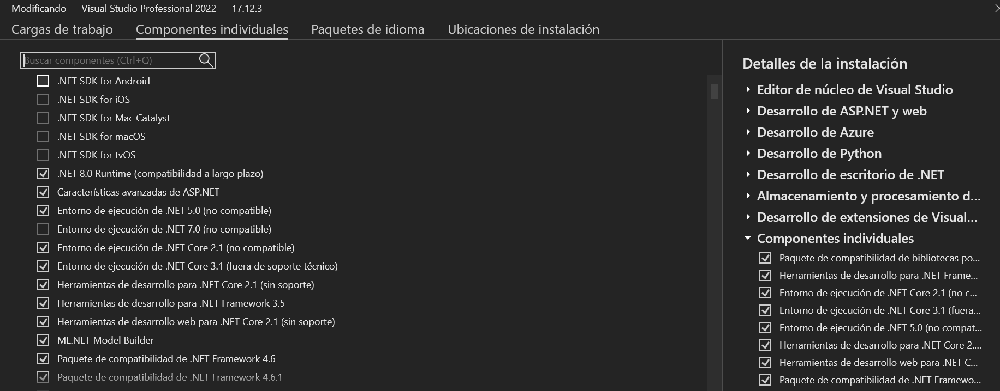
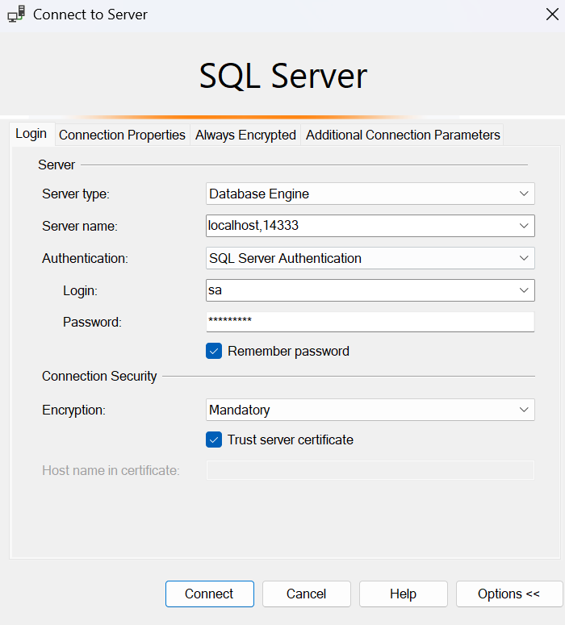
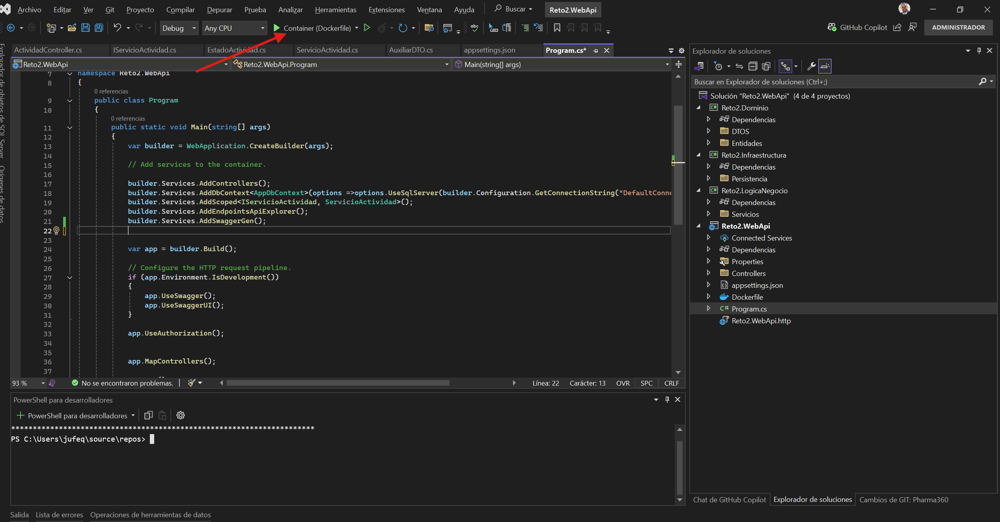
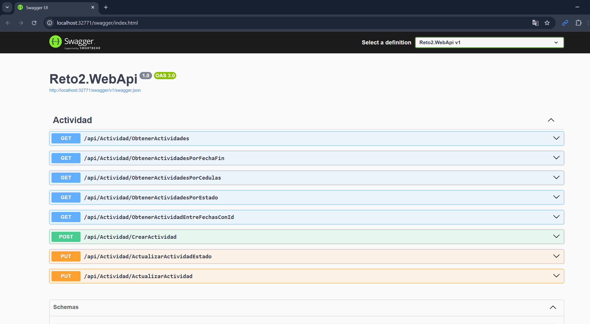

# technical-test-2025-1
📚 **Documentación Técnica: Sistema de Gestión de Actividades Académicas**

---

## 1. Introducción al Sistema

El sistema de gestión de actividades académicas es una solución backend desarrollada en **.NET 8** para la administración eficiente de las actividades realizadas por auxiliares docentes. Surge como respuesta a la necesidad de digitalizar procesos académicos anteriormente gestionados en formatos físicos, brindando:

* **Centralización de la información**: Todos los datos se almacenan en una base de datos SQL Server estructurada.
* **Automatización de procesos**: Cálculo automático de horas trabajadas, cambios de estado y validaciones.
* **Acceso remoto**: API RESTful accesible desde cualquier cliente frontend (web o móvil).

**Ejemplo de Caso de Uso:**

> "Cuando un auxiliar completa una revisión de exámenes, registra la actividad en el sistema especificando fecha, hora y descripción. El coordinador recibe una notificación para aprobar la actividad, la cual queda registrada para generar reportes mensuales."

---

## 2. Arquitectura Técnica

### 2.1 Estructura en Capas

La solución sigue los principios de **Clean Architecture**, organizándose en cuatro capas fundamentales:

#### 1. Capa de Dominio:

* Contiene las entidades centrales del negocio (Actividad, Auxiliar, Rol, EstadoActividad).
* Define interfaces abstractas (por ejemplo: `IServicioActividad`) para operaciones clave.
* Ejemplo: La clase `Actividad` posee propiedades como `FechaInicio`, `FechaFin`, `Descripcion`, `EstadoId`, `AuxiliarId`, etc.

#### 2. Capa de Aplicación (Lógica de Negocio):

* Contiene servicios que implementan las reglas de negocio.
* Utiliza el patrón **CQRS** para separar operaciones de lectura y escritura.
* Ejemplo: `ServicioActividad` gestiona el registro, aprobación y consulta de actividades.

#### 3. Capa de Infraestructura:

* Implementación de persistencia de datos mediante **Entity Framework Core**.
* Define `AppDbContext` y las configuraciones de entidades y relaciones en `OnModelCreating()`.

#### 4. Capa de Presentación (WebAPI):

* Expone endpoints HTTP con controladores RESTful.
* Maneja autenticación, validaciones y respuestas API.
* Ejemplo: `ActividadController` con métodos como `GetActividadesPorFecha`, `PostActividad`, `PatchEstadoActividad`.

### 2.2 Diagrama de Componentes

(📌 Aquí puede incluirse una imagen que muestre la arquitectura por carpetas y flujos de datos)

```
Reto2/
├── Dominio/
│   ├── Entidades/           # Actividad.cs, Auxiliar.cs, Rol.cs
│   └── DTOS/                # ActividadDTO.cs, AuxiliarDTO.cs
├── Infraestructura/
│   └── Persistencia/        # AppDbContext.cs
├── LogicaNegocio/
│   ├── Servicios/           # ServicioActividad.cs
│   └── Interfaces/          # IServicioActividad.cs
├── WebApi/
│   ├── Controllers/         # ActividadController.cs
│   └── appsettings.json     # Configuración
└── Dockerfile               # Contenedor SQL Server
```

---

## 3. Configuración del Entorno

### 3.1 Software Requerido

| Componente         | Versión Requerida | Enlace de Descarga                                                                                                     |
| ------------------ | ----------------- | ---------------------------------------------------------------------------------------------------------------------- |
| .NET SDK           | 8.0+              | [https://dotnet.microsoft.com/download](https://dotnet.microsoft.com/download)                                         |
| Docker Desktop     | 24.0+             | [https://www.docker.com/products/docker-desktop](https://www.docker.com/products/docker-desktop)                       |
| SQL Server         | 2022              | [https://www.microsoft.com/sql-server/sql-server-downloads](https://www.microsoft.com/sql-server/sql-server-downloads) |
| Node.js (Opcional) | 18+               | [https://nodejs.org/](https://nodejs.org/)                                                                             |

### 3.2 Requisitos de Hardware

* 4 GB de RAM
* 10 GB de espacio libre en disco
* Procesador de 64 bits a 2 GHz o superior

---

## 4. Configuración Inicial del Proyecto

### 4.1 Configuración de Base de Datos (appsettings.json)

```json
{
  "ConnectionStrings": {
    "DefaultConnection": "Server=localhost;Database=Academico;User=sa;Password=ClaveSegura123;"
  },
  "Logging": {
    "LogLevel": {
      "Default": "Information",
      "Microsoft": "Warning"
    }
  }
}
```

* En entornos de producción se recomienda:

  * Usar variables de entorno o Azure Key Vault para almacenar secretos.
  * Usar conexiones cifradas y control de acceso estricto.
  * Ajustar el nivel de logging a `Warning` o superior.

### 4.2 Ejecución de SQL Server vía Docker (Recomendado)

```bash
docker run -e "ACCEPT_EULA=Y" -e "SA_PASSWORD=Admin123!" -p 14333:1433 --name reto2-db -d mcr.microsoft.com/mssql/server:2022-latest
```

---

## 5. Funcionalidades Principales

### 5.1 Gestión de Actividades Académicas

* Registro de actividades con validaciones de fechas y duración automática.
* Aprobación o rechazo por parte de coordinadores.
* Consultas por rango de fechas, estado, auxiliar, etc.
* Cálculo de horas trabajadas.

#### 1. Registro de Actividades

```csharp
public async Task<bool> CrearActividadAsync(ActividadDTO actividadDTO)
{
    var actividad = new Actividad {
        Descripcion = actividadDTO.Descripcion,
        FechaInicio = actividadDTO.FechaInicio,
        FechaFin = actividadDTO.FechaFin,
        EstadoId = 1 // Pendiente
    };
    _dbContext.Actividades.Add(actividad);
    return await _dbContext.SaveChangesAsync() > 0;
}
```

#### 2. Consultas Especializadas

```sql
SELECT SUM(DATEDIFF(HOUR, FechaInicio, FechaFin))
FROM Actividades
WHERE CedulaAuxiliar = '123';
```

#### 3. Estados de Actividad

| Estado    | 
| --------- | 
| Pendiente | 
| Aprobado  |
| Rechazado | 

### 5.2 Seguridad y Validaciones

* **Validación de datos**: A través de anotaciones (`[Required]`, `[StringLength]`, validación de fechas, etc.).
* **Prevención de inyecciones SQL**: Uso exclusivo de EF Core.
* **Separación de DTOs y Entidades**: Minimiza exposición de la lógica interna.

---

## 6. Patrones y Buenas Prácticas

### 6.1 Arquitectura Limpiar (Clean Architecture)

* Separación clara entre Dominio, Aplicación, Infraestructura y Presentación.

### 6.2 Inyección de Dependencias

```csharp
builder.Services.AddScoped<IServicioActividad, ServicioActividad>();
```

### 6.3 Principios SOLID

* SRP: Servicios separados para cada responsabilidad.
* DIP: Interfaces desacopladas.
* OCP: Extensibilidad a través de nuevas implementaciones.

### 6.4 Ventajas de la Programación Asíncrona

* Mejora el rendimiento al permitir la ejecución no bloqueante de operaciones I/O.
* Mejora la escalabilidad del sistema en ambientes concurrentes.
* Uso de `async`/`await` en operaciones como `SaveChangesAsync()`.

Ejemplo de flujo:
  sequenceDiagram
    Auxiliar->>API: POST /actividades
    API->>DB: INSERT actividad
    DB-->>API: Confirmación
    API->>Coordinador: Notificación
    Coordinador->>API: PATCH /actividades/{id}/aprobar
    API->>DB: UPDATE estado

diagrama de componentes:
graph TD
    A[Frontend] --> B[ActividadController]
    B --> C[ServicioActividad]
    C --> D[AppDbContext]
    D --> E[(SQL Server)]
    C --> F[ServicioNotificaciones]
---

## 7. Guía de Instalación y Ejecución Local

1. Clona el repositorio:

```bash
git clone https://github.com/usuario/sistema-academico.git
cd sistema-academico
```

2. Restaura los paquetes NuGet:

```bash
dotnet restore
```

3. Ejecuta las migraciones para generar la base de datos:

```bash
dotnet ef database update
```

4. Inicia la aplicación:

```bash
dotnet run --environment Development
```

5. (Opcional) Ejecuta SQL Server con Docker si no tienes uno local:

```bash
docker start reto2-db
```

---
más ajustes si llega a falla, solo es abrir el visual studio y descargar estas dependencias.


tambien esta el docker de la base de datos 
Correr esta Linea de codigo tal cual: docker run -e "ACCEPT_EULA=Y" -e "SA_PASSWORD=Admin123!" -p 14333:1433 --name sqlserver -d mcr.microsoft.com/mssql/server:2022-latest

abren sql server y les debe salir algo asi



dado el caso que este no llegue a funcionar en el git se encuentra tambien los jquerys para crear las tablas y los datos.

tambien existe una opcion de despliegue con ngrok
https://ngrok.com/
se descarga el archivo se abre en la terminal estando en el directorio donde esta el archivo ngrok. se ejecuta ngrok http 5000
 todo esto teniendo en cuenta que los 2 dockers esten corriendo.
 asi


 una ves corran el rpoyecto debe salir algo asi en el swagger.
 
 


